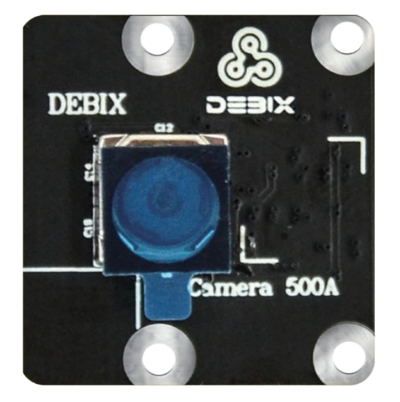
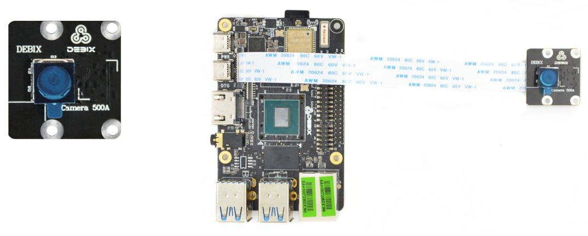
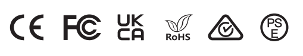
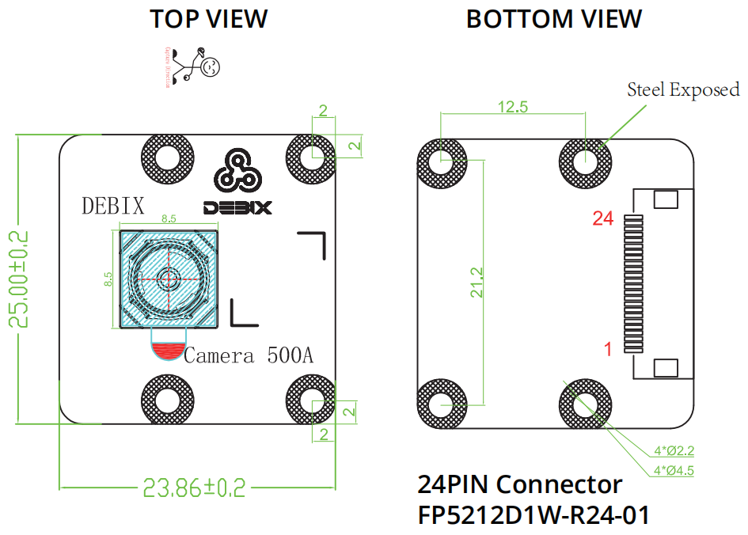

# DEBIX Camera 500A Module
 

## Overview
DEBIX Camera 500A Module utilizes the OV5640 sensor with 5 megapixels still resolution. Installed with an infrared filter, it takes photos and videos close to what you see with your eyes. It allows focusing functionality and three video modes, with higher frame rates at lower resolutions. Compared with the Camera 200A, it supports taking full HD videos at 30fps.

## Main Features:
- 5 megapixels still resolution, three video modes: 2592 x 1944/15fps, 1920 x 1080/30fps, 1280 x 960/45fps
- 72 degrees diagonal FOV, 58 degrees horizontal FOV, 45 degrees vertical FOV
- Focusing for default, and it could be changed to fixed focus

## Compatibility:
- Compatible with DEBIX Model A, DEBIX Model B, DEBIX Model C, DEBIX Infinity and DEBIX R3576-01
- Support for use with DEBIX SOM A I/O Board through an add-on board

## Specification
| Camera 500A     |                              |
|:-----------------|------------------------------|
| Still Resolution| 5 megapixels                 |
| Video Mode      | 2592 x 1944/15fps 1920 x 1080/30fps 1280 x 960/45fps    |
| Sensor          | OV5640                       |
| Sensor Resolution | 2592 x 1944 pixels         |
| Sensor Image Area | 3.67mm x 2.74mm           |
| Pixel Size      | 1.4μm x 1.4μm              |
| Optical Size    | 1/4"                         |
| Depth of Field  | Approx 10cm to ∞             |
| Diagonal FOV    | 72 degrees                   |
| Horizontal FOV  | 58 degrees                   |
| Vertical FOV    | 45 degrees                   |
| Focus           | Focusing                     |
| Focal Length    | 3.25mm                       |
| Focal Ratio (F-Stop)  | 2.8                    |
| Maximum Exposure Time (seconds)  |390          |
| Lens Mount      | N/A                          |
| Size            | 25mm x 24mm x 7.5mm         |
| Gross Weight    | 13g                          |
| Flexible Flat Cable  | 15cm                    |
 
| Camera Lens     |                              |
|:-----------------|------------------------------|
| Output Formats  | Raw/YCbCr4:2:2/RGB565        |
| Lens Construction | 3P+1IR                     |
| TV Distortion    | <1%                         |
| Thread          | M6.0 x 0.35P                 |
| IR Filter       | 650±10nm                     |
| S/N Ratio       | 36dB                         |
| Dynamic Range   | 68dB                         |
| Power Supply    | Core: 1.5VDC Analog: 2.8VDC I/O: 3.3VDC   |
| Power Consumption | Operating: 160mW           |
| Temperature Range | Operating Temp.: -30℃\~70℃ Storage Temp.: -40℃\~85℃ |

## Certificates

## Mechanical Dimension:

## Pin Definition: (24-Pin Description)

|Pin| Definition          |
|---|---------------------|
| 1 | VDD_5V              |
| 2 | VDD_3V3             |
| 3 | VDD_1V8             |
| 4 | CSI-PWD             |
| 5 | CSI-NRST            |
| 6 | CSI-I2C-SDA         |
| 7 | CSI-I2C-SCL         |
| 8 | CSI-SYNC            |
| 9 | CSI-MCLK            |
| 10 | GND                |
| 11 | CSI-DN0            |
| 12 | CSI-DP0            |
| 13 | GND                |
| 14 | CSI-DN1            |
| 15 | CSI-DP1            |
| 16 | GND                |
| 17 | CSI-CKN            |
| 18 | CSI-CKP            |
| 19 | GND                |
| 20 | *CSI-DN2(NC)*      |
| 21 | *CSI-DP2(NC)*      |
| 22 | GND                |
| 23 | *CSI-DN3(NC)*      |
| 24 | *CSI-DP3(NC)*      |

## Contact Us
- **Headquarters**: DEBIX Technology Inc., 8345 Gold River Ct., Las Vegas, NV 89113, USA  
- **Factory**: 5-6/F., East Zone, Shunheda A2 Building, Liqxiandong Industrial Park, XiLi, Nanshan Dist., Shenzhen, China  
- **Email**: info@debix.io  
- **Website**: [www.debix.io](https://www.debix.io)  
- **Community**: [Discord](https://discord.com/invite/adaHHaDkH2)